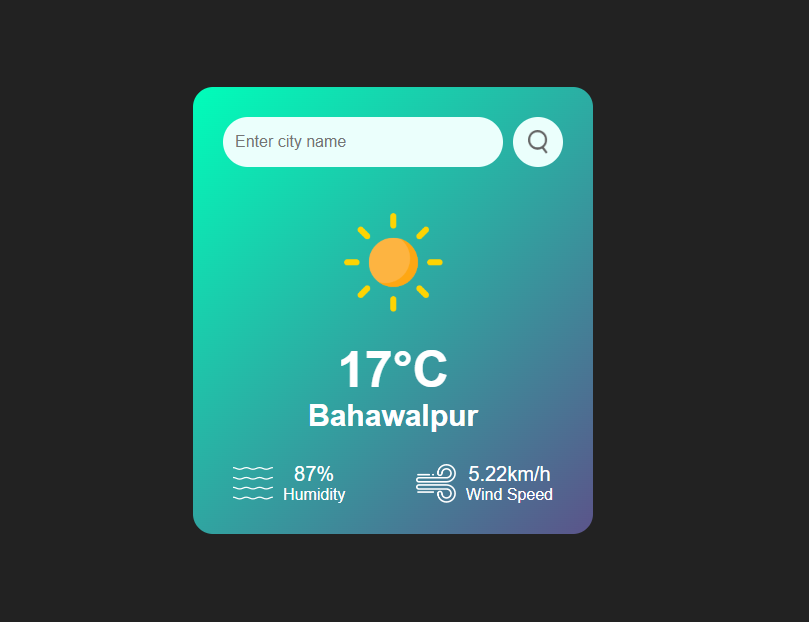

# Weather App 🌤️

A simple and responsive Weather App built using HTML, CSS, and JavaScript. The app fetches real-time weather data and displays temperature, wind speed, and humidity.

## Features 🚀
- Fetches weather data based on user's current location (latitude & longitude) by default.
- Allows users to search for weather conditions by city name.
- Displays key weather details: 
  - Temperature 🌡️
  - Wind Speed 💨
  - Humidity 💧
- Responsive and user-friendly UI, optimized for all devices.

## Technologies Used 🛠️
- **HTML** - Structure of the app.
- **CSS** - Styling for an appealing UI.
- **JavaScript** - Fetching and displaying weather data.
- **Weather API** - Retrieves real-time weather information.

## How to Use 🏗️
1. Clone the repository:
   ```sh
   git clone https://github.com/Muhammad-Shoaib-104/Weather-App.github.io
   ```
2. Open `index.html` in a browser.
3. Allow location access to get weather data for your current location.
4. Enter a city name in the search bar to check the weather for any location.

## Screenshots 📸



## API Used 🌍
- Weather API used: **OpenWeatherMap**

## Contributing 🤝
Feel free to contribute by submitting a pull request. Suggestions and improvements are always welcome!

## License 📜
This project is open-source and available under the [MIT License](LICENSE).
